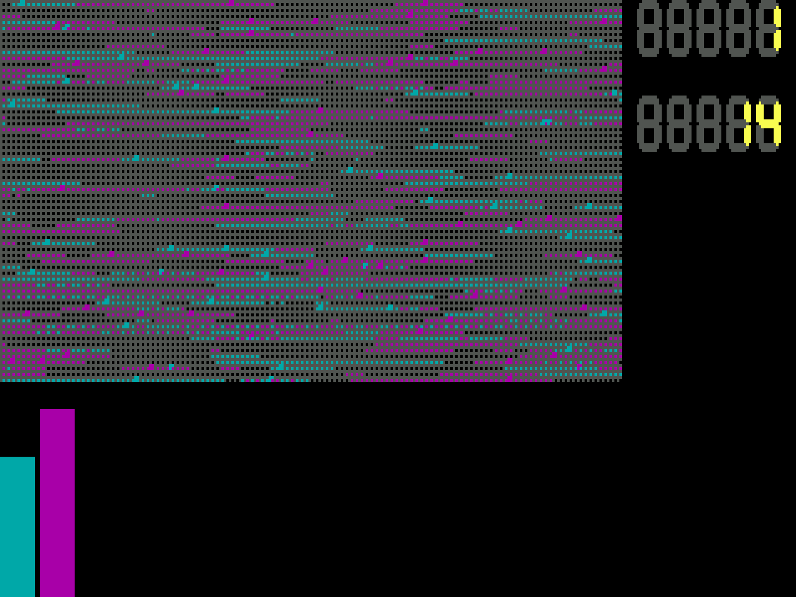

# Reproduction

A round robin between the CoreWar programs in the [`Historical`](../Historical) folder, played with
Viktor's 1993 `MARS.COM` under DOSBox.

> This is **not** the original competition data of the First Hungarian Memory War (CoreWar)
> Championship of 1993. Some programs here were never entries at all. The results below come from a new tournament played in
> 2026 and do not tell how the original competition ended.



## Documents

- Results report: [Markdown](results/report.md), [HTML](results/report.html), [ODT](results/report.odt)
- Raw results, one row per pair and start order: [results/runs.csv](results/runs.csv)
- Unprocessed MARS statistics output of every run: [raw/](raw)
- Example screenshots and videos: [media/](media)

## Results

630 pairs, 630000 games. The top five by Elo, see the [report](results/report.md) for the full ranking
and matrices:

| Rank | Program | Elo | Points | Wins | Draws | Losses |
|---:|:--|---:|---:|---:|---:|---:|
| 1 | PRB004 | 1673 | 194.5 | 17758 | 14803 | 2439 |
| 2 | PRB011 | 1662 | 189.0 | 16765 | 15856 | 2379 |
| 3 | MICE | 1651 | 182.5 | 15338 | 17854 | 1808 |
| 4 | PRB005 | 1649 | 186.0 | 16711 | 14954 | 3335 |
| 5 | MICE2 | 1635 | 173.3 | 13527 | 20079 | 1394 |

Half of the games (314190) ended in a draw. Moving first made no real difference: the first program
won 157527 games and the second 158283. The two scores disagree for programs that win and lose a lot.
Y, for example, has the fifth most points but is only tenth by Elo, because it lost 10861 games.

## Programs

36 programs take part. Where a program came from is taken from its own comments or from the notes in
`Historical`; the rest is unknown.

| Program | Notes |
|:--|:--|
| ANTIIMP | Imp killer, the second example in the rules (`SZABALY.TXT`) |
| ARTUR-1, ARTUR-2, ARTUR-3 | Unknown author, going by the file name someone called Artúr |
| CHANG | Morrison J. Chang, second in the 1985 championship |
| CHANG2 | "Imp-tank-worm", the imp spawning part of CHANG |
| CREEPER | Unknown |
| GABOR1 | Molnár Gábor's experimental program |
| HARVKILL | Unknown |
| IMP | A. K. Dewdney's imp (`MOV 0 1`) |
| KILLER, KILLER01, KILLER02, KILLER03, KILLER2 | Probably Viktor's; `TALAKA.TXT` calls KILLER and PRB006 "the best" of his programs |
| MICE | Chip Wendell, winner of the 1985 championship |
| MICE2 | MICE with a different copy length and step |
| PRB001 to PRB011 | Probably Viktor's experiments (*próba* means trial) |
| ROHAMO | *Rohamosztag* (assault squad) |
| TORPE | Dwarf (*törpe*), like the bomber example in the rules but bombing every 5th cell |
| VIKTOR01 to VIKTOR05 | Viktor's first attempts |
| Y | HARVEST by Tóth László, 11 October 1993 |

Left out: `NONE.CWR` (only `JMP START`), `TEST.CWR` (a compiler test), `ROHANO.CWR` (a copy of
`ROHAMO.CWR`) and the files without extension that are copies of a `.CWR` file (`ANTIIMP`, `CHANG`,
`CHANG2`, `IMP`, `MICE`, `ROHAMO`, `TORPE`). `MICE2` and the `ARTUR-*` files have no `.CWR` counterpart,
so they stay.

## How the tournament was run

Each pair played 1000 games: 500 with one program loaded first and 500 with the other. MARS runs the
programs in load order, one instruction each in turn, so the first one always moves first. Every run
uses the defaults of MARS, which match the 1993 rules: 8000 cell arena, 64 processes per program,
programs may execute each other's code, and a war is a draw after 600000 steps.

`mars.py tournament` starts one headless DOSBox per pair, up to 8 at a time, and runs this inside:

```
D:\MARS D:\MICE.CWR D:\KILLER.CWR /P=500 /M=600000 /V /F=AB.LOG > AB.STA
D:\MARS D:\KILLER.CWR D:\MICE.CWR /P=500 /M=600000 /V /F=BA.LOG > BA.STA
```

`/P` is the statistics mode with the number of games, `/V` switches off the arena display, and the
statistics go to standard output. The script keeps each output in `raw/` and appends the parsed
numbers to `results/runs.csv`. When it is started again it skips the pairs already in the CSV.
`report.py` turns the CSV into the report in three formats (it needs `pandoc`).

## Running MARS

Requirements: DOSBox 0.74, Python 3.12, and `pandoc` for the report. The scripts mount `Historical`
read only as drive `D:` and never write to it.

Watch a battle in a DOSBox window. The default speed is about that of a 286. `--delay` sets the MARS
`/S` slow-down loop, and Ctrl+F11/Ctrl+F12 change the DOSBox speed while it runs. ESC stops the battle,
any key closes MARS at the end.

```bash
./mars.py watch MICE.CWR KILLER.CWR --delay 400
```

Play the full tournament, then make the report:

```bash
./mars.py tournament --jobs 8
```

```bash
./report.py
```

Record a video and four screenshots into `media/`. This also needs Weston, Xephyr, ffmpeg and `bc`.
DOSBox runs on a headless display, so no window opens on the desktop.

```bash
NAME=MICE_vs_KILLER_opening ./record.sh MICE.CWR KILLER.CWR 60 --delay 400
```

## What the MARS screen shows

The arena takes the top left: 8000 cells in 64 rows of 125, each cell 2x2 pixels. The color of a cell
shows which program wrote it last (cyan for the first program, magenta for the second), and the
whole cell lights up in a program's color when that program executes the instruction in it. The upper counter on the right is the game number, the lower
one the elapsed steps in thousands. The bars at the bottom left show how many processes each program
has, up to 64.

## Notes on MARS

- MARS takes any number of programs, but after 14 it cannot open more program files. It does not close
  them after compiling (`CLOSEFILE` is never called), so it runs out of DOS file handles. Pairs are not affected.
- In statistics mode MARS checks every 16000 steps whether any `DAT` is left in the arena. If none is,
  nobody can die any more, so it ends the game as a draw. This makes imp against imp style games short.
- The random placement is seeded from the BIOS timer, so every run is different.
- A drawn game of 600000 steps takes about 0.6 s in DOSBox with `cycles=fixed 2000000` on the dynamic
  core. The slowest pair took 16 minutes, the whole tournament less than 4 hours with 8 in parallel.
